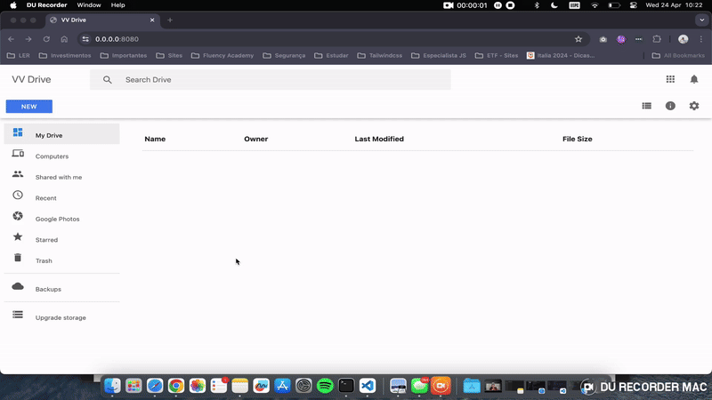

## Preview

## Checklist Features

- Web API
    - [X] It should list downloaded files
    - [X] It must stream files and save them in disk
    - [X] It should notify about progress of storing files to disk
    - [X] It must allow uploading of files in image, video or audio format
    - [X] It must reach 100% code coverage in tests

- Web App
    - [] Should list downloaded files
    - [] Should allow uploading of files of any size
    - [] Must have upload function via button
    - [] Should display upload progress
    - [] Must have drag and drop upload function

## Layout Credits <3

- The Layout was adapted from the project by the Brazilian [Leonardo Santo](https://github.com/leoespsanto) available on [codepen](https://codepen.io/leoespsanto/pen/KZMMKG).

## FAQ
- `NODE_OPTIONS` is not a system recognized command, what to do?
    - If you are on Windows, the way to create environment variables is different. You must use the word `set` before the command.
    - Ex: ` "test": "set NODE_OPTIONS=--experimental-vm-modules && npx jest --runInBand",`

- SSL certificate is invalid, what to do?
    - This error happens because I generated a certificate linked to the user of my machine.
    - You can click on proceed in the browser and use the invalid certificate and the project will continue working, but if you want to generate your own, I wrote the step by step in [./certificates](./certificates)

- I ran `npm test` but nothing happens, what to do?
    - Check your Node.js version. We are using version 16.8. Go to [node.js website](https://nodejs.org) and download the latest version.
